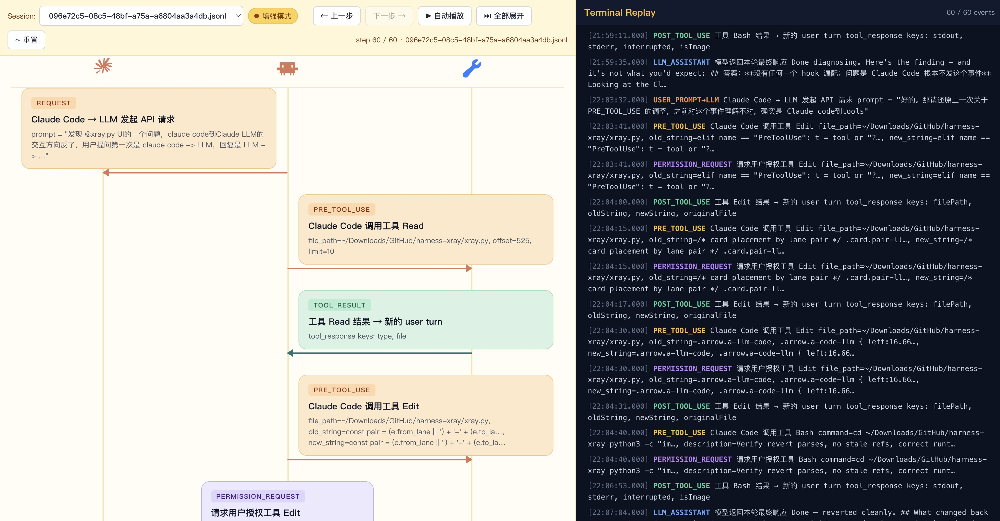

# harness-xray

> An interactive X-ray for the Claude Code **agent loop** — record every hook event to JSONL, then replay the whole `LLM ⇄ Claude Code ⇄ Tools` conversation in your browser.

`harness-xray` turns the hook stream that Claude Code emits during a session into a structured log, and ships a zero-dependency web UI that lets you scrub through the session as a sequence diagram next to a terminal-style replay — with full JSON payload inspection for every event.

> 

---

## ✨ Features

- **Complete session recording.** A single Bash hook (`log-jsonl.sh`) captures every event Claude Code emits — tool calls, permission prompts, subagents, tasks, session boundaries — and appends them as JSONL to `~/.claude/session-logs/<session_id>.jsonl`. Sessions are split by `session_id`, so each run gets its own replayable log.
- **One-command install.** `install_hooks.py` copies the hook into `~/.claude/hooks/` and merges all the needed event entries into your user `~/.claude/settings.json`, with a timestamped backup and a `--dry-run` preview.
- **Interactive web replay.** `xray.py` serves a single-page app that renders the full agent loop as a three-lane sequence diagram (`Claude LLM` · `Claude Code` · `Tools`) paired with a live terminal-style event log.
- **Step-by-step controls.** Prev / Next / Auto-play / Reset / Expand-All buttons, plus `←` `→` keyboard shortcuts, let you walk through a session one hook at a time or watch it play back.
- **Full payload inspection.** Click any card or terminal line to open a modal with the raw JSON as a collapsible, syntax-highlighted tree — expand-all / collapse-all / copy JSON all built in.
- **Normal vs. Enhanced modes.** Toggle between the core `request → pre-tool → tool-result → assistant` loop and an enhanced view that also surfaces permission requests, elicitations, subagent lifecycles, and task events.
- **Dropdown session picker.** All `*.jsonl` files under the sessions directory show up in a dropdown — switch between recordings without restarting the server.
- **Zero runtime dependencies.** Pure Python standard library + `jq` + a single HTML blob served from memory. No `pip install`, no `npm`, no Node.

---

## 🧩 How it works

> 注意: 由于 Claude Code 限制，目前此方案无法抓取真实 LLM 的请求和回复

```
┌─────────────────┐   hook events    ┌──────────────────┐   jsonl lines    ┌──────────────────────────────┐
│   Claude Code   │ ───────────────► │   log-jsonl.sh   │ ───────────────► │ ~/.claude/session-logs/      │
│   (your CLI)    │                  │  (Bash + jq)     │                  │   <session_id>.jsonl         │
└─────────────────┘                  └──────────────────┘                  └──────────────────────────────┘
                                                                                        │
                                                                                        ▼
                                                                            ┌──────────────────────────────┐
                                                                            │   xray.py  (local HTTP UI)   │
                                                                            │   sequence diagram + replay  │
                                                                            └──────────────────────────────┘
```

Every Claude Code hook (`PreToolUse`, `PostToolUse`, `UserPromptSubmit`, `Stop`, `PermissionRequest`, `SubagentStart`, …) pipes its JSON payload into `log-jsonl.sh` through stdin. The script extracts a few index fields (`hook_event_name`, `session_id`, `tool_name`, `tool_use_id`) and writes one lossless JSONL record per event. `xray.py` then reads those logs, classifies each event into a lane-to-lane arrow on the sequence diagram, and renders it.

---

## 📦 Repository layout

| File | Role |
|------|------|
| `log-jsonl.sh` | The hook script. Reads JSON from stdin, writes one JSONL line per event to `~/.claude/session-logs/<session_id>.jsonl`. |
| `install_hooks.py` | Installs the hook script and merges all required hook entries into `~/.claude/settings.json` (with backup + dry-run). |
| `xray.py` | The visualizer. A self-contained HTTP server (stdlib only) that serves the single-page replay UI on `http://127.0.0.1:8080`. |

---

## 🔧 Requirements

- **Claude Code** installed and configured (hooks require the `~/.claude/settings.json` it owns).
- **Python 3.8+** (standard library only — no `pip install` required).
- **`jq`** on `PATH` (used by the hook script). Install via `brew install jq` / `apt install jq`.
- A modern browser for the replay UI.

---

## 🚀 Quick start

### 1. Install the hook

From a clone of this repo:

```bash
python3 install_hooks.py
```

This will:

1. Copy `log-jsonl.sh` to `~/.claude/hooks/log-jsonl.sh` and mark it executable.
2. Back up your existing `~/.claude/settings.json` (if present) to `settings.json.bak.<timestamp>`.
3. Merge every required hook entry into the `hooks` section of your settings file, leaving the rest of your config untouched.

Preview what it would do first:

```bash
python3 install_hooks.py --dry-run
```

Install into a non-default settings file:

```bash
python3 install_hooks.py --target ~/some/other/settings.json
```

> The installer only writes to `.hooks.*`. If a given event was already configured there, it is overwritten with the logger entry; everything else in your settings is preserved.

### 2. Use Claude Code normally

Run Claude Code as you always do. Each session will write a new file:

```
~/.claude/session-logs/<session_id>.jsonl
```

### 3. Open the X-ray

```bash
python3 xray.py
```

The server starts on `http://127.0.0.1:8080/`, auto-opens your browser, and lists every `*.jsonl` file in `~/.claude/session-logs/` in the dropdown.

Flags:

```bash
python3 xray.py --host 127.0.0.1 --port 8080              # defaults
python3 xray.py --sessions /path/to/other/session-logs    # custom log dir
python3 xray.py --no-open                                 # don't auto-open browser
```

---

## 🖥️ Using the UI

- **Session dropdown** — switch between any `.jsonl` in the sessions directory.
- **Normal / Enhanced toggle** — Normal shows the core loop; Enhanced adds permission, elicitation, subagent, and task events.
- **Step controls**
  - `← / →` or `Space` — step backward / forward
  - `▶ Auto-play` — animate the session
  - `⏭ Expand All` — jump to the end
  - `⟳ Reset` — back to step 0
- **Clickable cards & terminal lines** — open a modal with the full JSON payload, collapsible tree, and a Copy-JSON button.
- **Left pane** — three-lane sequence diagram with color-coded arrows:
  - Orange: `Claude Code → LLM` requests, `Claude Code → Tools` calls
  - Blue: `LLM → Claude Code` assistant responses, elicitations
  - Green: successful tool results, elicitation answers, subagent returns
  - Red: tool failures, permission denials, abnormal stops
  - Purple: permission requests
- **Right pane** — terminal-style replay, sync-scrolled with the left pane.

---

## 📚 What gets logged

The installer registers these hook events (all Claude Code built-ins):

**Normal mode events**
`SessionStart`, `SessionEnd`, `UserPromptSubmit`, `PreToolUse`, `PostToolUse`, `PostToolUseFailure`, `Stop`, `StopFailure`

**Enhanced mode events (added on top)**
`PermissionRequest`, `PermissionDenied`, `Elicitation`, `ElicitationResult`, `SubagentStart`, `SubagentStop`, `TaskCreated`, `TaskCompleted`

Each JSONL record looks like:

```json
{
  "ts": "2026-04-18T13:24:05Z",
  "epoch_s": 1765030645,
  "hook_event_name": "PreToolUse",
  "session_id": "abc123",
  "agent_id": null,
  "tool_name": "Bash",
  "tool_use_id": "toolu_01ABC",
  "payload": { "...": "full original hook payload" }
}
```

The full original payload is preserved verbatim under `payload` for lossless replay.

---

## 🔐 Privacy note

Claude Code hook payloads include your prompts, tool inputs, and tool outputs. The log files live entirely on your local machine under `~/.claude/session-logs/` — nothing is uploaded. Delete or rotate them as you see fit. Do not share raw JSONL without scrubbing sensitive content.

---

## 🛠️ Manual setup (no installer)

If you prefer to configure hooks by hand, copy `log-jsonl.sh` to `~/.claude/hooks/log-jsonl.sh`, `chmod +x` it, and merge the `hooks` block from `settings.json` in this repo into your own `~/.claude/settings.json`.

---

## 🤝 Contributing

Issues and PRs welcome. Good things to work on:

- Additional event classifications / lane pairs
- Timeline-level diffing between two sessions
- Export to static HTML for sharing
- Richer payload renderers for specific tools (diffs for `Edit`, rendered Markdown for `WebFetch`, etc.)

### Design prompts

```
编写一个展现一个会话的完整 Agent loop 工作流的程序，用于分析调用链的问题。日志参考 {session_examples.jsonl}

要求：

1.左侧序列图追踪每次消息流转，右侧终端完整回放整个交互历史。点击任意消息块可查看完整 prompt / JSON payload，并支持
JSON 的语法加亮和块折叠
2.支持动态选择 sessions/ 下的会话，并支持通过按钮分步呈现调用过程
3.支持增强模式（默认关闭以简化展示内容）。不同模式的区别

普通模式（仅包含与LLM/Claude Code/Tools间的通信）

1.SessionStart / SessionEnd 原因：给调用链加边界，不然无法准确切分一段会话。
2.UserPromptSubmit 原因：这是“发给模型的用户请求起点”。
3.PreToolUse 原因：这是“模型回复中的工具调用请求”（模型要求执行什么命令）。
4.PostToolUse + PostToolUseFailure 原因：这是“工具执行结果回传给模型”的回复边，成功和失败都必须覆盖。
5.Stop + StopFailure 原因：兜底会话异常终止；有些异常场景可能缺 SessionEnd。

增强模式（详细调用链）

1.PermissionRequest + PermissionDenied 原因：补全 why 分支。否则你会看到 PreToolUse 后没有 PostToolUse，但不知道是被权限卡住还是别的失败。
2.Elicitation + ElicitationResult 原因：模型向用户追问的往返链路，不记录会丢失关键中间请求/答复。
3.SubagentStart + SubagentStop + TaskCreated + TaskCompleted 原因：多代理/并行任务时，主链会分叉；没有这些事件很难还原“谁发起、谁执行、谁返回”。
```

---

## 📄 License

MIT — see `LICENSE` if present, otherwise treat this project as MIT-licensed.
